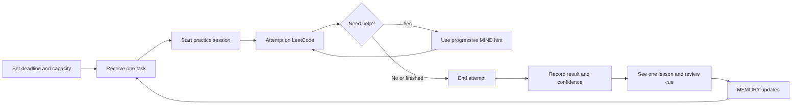

# LeetCode Coach Visual Workflow

This document defines the MVP screens, hierarchy, and state transitions. It is not a marketing-site brief.

## Experience Rule

The interface should answer one question first:

> What should I do now?

The default screen is **Today**. MIND appears inside a practice session, where it has useful context. Progress is secondary evidence, not the main attraction.

## Information Architecture

```text
Setup
  -> Today
       -> Practice Session
            -> Reflection
            -> Feedback
            -> Today
       -> Progress

Primary navigation: Today | Progress
```

There is no landing page after login, no global chat screen, and no separate analytics dashboard.

## Core Flow



The loop should feel like one session, not a chain of unrelated forms.

## Screen 1: Setup

Purpose: collect only enough information to choose a credible first task.

```text
+--------------------------------------------------+
| LeetCode Coach                                   |
|                                                  |
| Build your first practice session                |
|                                                  |
| Interview date        [ Month / Day / Year ]     |
| Sessions each week    [ - ]  4  [ + ]            |
| Minutes per session   [ 30 v ]                   |
| Starting point        [New] [Some] [Reviewing]   |
|                                                  |
|                         [Build my first session] |
+--------------------------------------------------+
```

Rules:

- One screen, under two minutes.
- No required account questionnaire about learning style.
- No diagnostic quiz before value is shown.
- Explain that the plan will calibrate from real attempts.
- The primary button is disabled only when required fields are missing.

## Screen 2: Today

Purpose: remove choice and start useful practice quickly.

```text
+----------------------------------------------------------------+
| LeetCode Coach                         Today   Progress          |
+----------------------------------------------------------------+
| TODAY                                                          |
| 23 days until interview                         Session 6 of 28 |
|                                                                |
| TWO POINTERS                                                   |
| Valid Palindrome                                      Easy     |
| 25 minute target                                               |
|                                                                |
| Why this                                                       |
| You know array traversal, and this builds the comparison       |
| pattern needed before harder two-pointer problems.             |
|                                                                |
| [Start session]                                                |
|                                                                |
| Due later: 1 review                         View progress ->     |
+----------------------------------------------------------------+
```

Rules:

- One dominant task and one primary action.
- Explain the recommendation in one sentence using real evidence.
- Show deadline and session time without creating panic.
- Omit empty secondary sections instead of filling space.
- Do not show a grid of metric cards.

## Screen 3: Practice Session

Purpose: support focused work while preserving productive struggle.

```text
+--------------------------------------------------------------------------+
| <- Today   Valid Palindrome   Two Pointers   18:42   [End attempt]       |
+-------------------------------------------+------------------------------+
| PRACTICE                                  | MIND                         |
|                                           |                              |
| Goal                                      | What have you tried so far?  |
| Find the comparison rule and state the    |                              |
| invariant before writing code.            | [Type a message...]          |
|                                           |                              |
| [Open problem on LeetCode]                | [Give me a hint]             |
|                                           |                              |
| Notes                                     | Hint controls after reply:   |
| +---------------------------------------+ | [Simpler] [Example] [Next]   |
| |                                       | |                              |
| |                                       | |                              |
| +---------------------------------------+ |                              |
|                                           |                              |
| Focus cue: What moves when chars match?   |                              |
+-------------------------------------------+------------------------------+
```

Rules:

- Do not copy the proprietary problem statement. Open the source in a new tab.
- Desktop uses a stable two-column layout: practice context and MIND.
- No embedded code editor or code execution in MVP.
- Notes autosave locally during the session.
- The timer is visible but quiet; it never blocks completion.
- MIND first asks about the user's attempt unless enough context is already present.
- The user can always end the attempt without using MIND.

### Progressive Hint Ladder

MIND reveals only the next useful layer:

1. **Nudge:** a question that directs attention.
2. **Pattern:** name the likely pattern and why it fits.
3. **Structure:** outline the invariant, states, or pseudocode.
4. **Explanation:** walk through the solution after a serious attempt or explicit request.

Each hint level used becomes attempt evidence. "Simpler," "Example," and "Trace it" change presentation, not hint depth.

## Screen 4: Reflection

Purpose: turn the attempt into structured evidence in under 30 seconds.

```text
+--------------------------------------------------------------+
| Finish attempt                                               |
|                                                              |
| Result                                                       |
| [Solved] [Not solved yet] [Viewed solution]                  |
|                                                              |
| Confidence                                                   |
| [1] [2] [3] [4] [5]                                         |
|                                                              |
| Optional note                                                |
| [__________________________________________________________] |
|                                                              |
|                                      [Review this attempt]   |
+--------------------------------------------------------------+
```

Rules:

- Result is required; confidence and the note are optional.
- Duration and highest hint level come from the active practice session.
- Use plain labels, not diagnostic jargon.
- MIND feedback is advisory and never rewrites the Attempt.

## Screen 5: Feedback

Purpose: close the session with clarity and a concrete memory update.

```text
+--------------------------------------------------------------+
| Session complete                                             |
|                                                              |
| What worked                                                  |
| You found the two-pointer movement rule without a hint.      |
|                                                              |
| Keep this                                                    |
| State what each pointer means before coding.                 |
|                                                              |
| Review                                                       |
| Retry a variant in 3 days.                                   |
|                                                              |
| Memory updated                                               |
| Two Pointers: Learning -> Practicing                         |
|                                                              |
|                                                [Finish]      |
+--------------------------------------------------------------+
```

Rules:

- Show one positive observation and one review cue.
- Show coaching advice only when validated MIND feedback is available.
- Praise evidence, strategy, or persistence; do not give generic applause.
- Show exactly what MEMORY changed.
- Do not immediately distract the user with another full problem.

## Screen 6: Progress

Purpose: show whether the training system is working and what needs attention.

```text
+----------------------------------------------------------------+
| PROGRESS                                                       |
| 23 days left   6 sessions completed   1 review due             |
|                                                                |
| Current path                                                   |
| Arrays & Hashing -> [Two Pointers] -> Sliding Window -> Stack  |
|                                                                |
| Pattern evidence                                               |
| Arrays & Hashing     Reliable       Last practiced Jul 11      |
| Two Pointers        Practicing     Review Jul 16               |
| Sliding Window      Unseen                                     |
|                                                                |
| Needs attention                                                |
| Edge cases           Repeated in 2 recent attempts             |
|                                                                |
| Due reviews                                                    |
| Contains Duplicate   Due today                  [Practice]      |
+----------------------------------------------------------------+
```

Rules:

- Prefer evidence labels over invented mastery percentages.
- Use full-width rows for comparison, not nested cards.
- Show the reason behind a weak status.
- Keep the roadmap editable later; MVP may only show it.

## MIND Response Shape

During practice, most replies should contain:

1. A short observation about the user's current approach.
2. One hint or explanation layer.
3. One check question that returns the thinking to the user.

Presentation controls:

- **Simpler:** shorter sentences and defined jargon for ESL or beginner needs.
- **Example:** a small concrete input, not the target problem's full answer.
- **Trace it:** a table or pointer/state trace when the algorithm benefits from one.
- **Next hint:** increase hint depth by one level.

These are user-controlled formats. The product should learn preferences from repeated choices without assigning a permanent learner type.

## State Transitions

| User event | State written | Next view |
|---|---|---|
| Completes setup | Profile and initial plan | Today |
| Starts task | Attempt start time | Practice Session |
| Requests hint | Hint level and format | Practice Session |
| Ends attempt | Elapsed time | Reflection |
| Submits reflection | One immutable Attempt; rebuilt skill and review projection | Feedback |
| Finishes session | Recomputed recommendation | Today |

Every persistent write in the product loop must be visible later in Progress or affect
a recommendation. The product Reflection screen submits one immutable Attempt. The
standalone free-text journal Reflection is domain/repository-only and has no Phase 2
UI. Attempts and standalone Reflections are durable source events. MEMORY is a
rebuildable Skill State projection from Attempts; a projection failure must never
discard or overwrite an Attempt.

## Responsive Behavior

- **Desktop:** maximum content width around 1120px. Practice and MIND use a 60/40 split.
- **Tablet:** preserve two columns while each remains usable; stack below that threshold.
- **Mobile:** practice content first; MIND opens as a full-height sheet. Primary actions remain reachable without covering content.
- Use stable heights for navigation, buttons, segmented controls, and timer so state changes do not shift the layout.
- Minimum touch target: 44px. No text or controls may overlap at 320px width.

## Visual Language

The app should feel focused, calm, and work-oriented.

- White or light-gray background, dark ink text, green primary action, amber review state, red only for errors.
- No gradients, decorative blobs, oversized hero text, or illustration-first layout.
- No card grids or cards nested inside cards.
- Maximum corner radius: 8px.
- System sans-serif typography; 16px base text; letter spacing 0.
- Use Lucide icons for familiar actions and tooltips for unfamiliar icon-only controls.
- Use color and text together for status; never rely on color alone.
- Motion is limited to useful state feedback and respects reduced-motion preferences.

## Required States

- **Loading recommendation:** keep the Today layout stable with a small inline loader.
- **MIND unavailable:** practice, notes, timer, and reflection still work; state that coaching is temporarily unavailable.
- **No active plan:** route to Setup.
- **Deadline passed:** ask for a new target before producing another roadmap.
- **No review due:** omit the review section.
- **Recommendation error:** offer retry and a deterministic next roadmap task.

## Visual Acceptance Test

The workflow is ready to implement when a user can:

1. Complete Setup without explanation from us.
2. Identify the one primary action on every screen within two seconds.
3. Start a useful session from Today with one click.
4. Ask for progressively deeper help without accidentally revealing everything.
5. Log an attempt in under 30 seconds.
6. See what MEMORY changed and why the next review exists.
7. Complete the entire flow at 320px mobile width without overlap or hidden controls.
